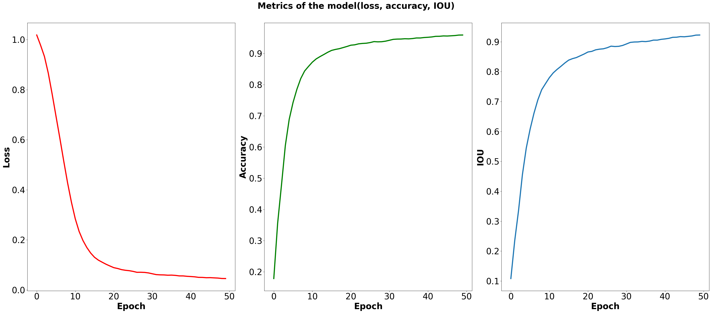

# Brain Tumor Detection with Segmentation using U-Net and Color Overlay

## Overview

This repository contains the code and resources for brain tumor detection using the U-Net deep learning architecture with color overlay. The U-Net model is a popular choice for image segmentation tasks, and we have extended it to perform brain tumor segmentation on MRI images. The color overlay is applied to visualize the segmented tumor regions, making it easier to interpret the results.

## Table of Contents

1. [Introduction](#introduction)
2. [Installation](#installation)
3. [Dataset](#dataset)
4. [Usage](#usage)
5. [Model Training](#model-training)

## Introduction

Brain tumor detection and segmentation are critical tasks in medical image analysis. The U-Net architecture is widely used in various segmentation tasks due to its effectiveness and efficiency. This project focuses on using the U-Net model to segment brain tumors from MRI scans. Additionally, we apply a color overlay to highlight the segmented tumor regions, which improves the visual interpretation of the results.

# What is U-Net?

U-Net is a deep learning architecture designed for image segmentation tasks. It was proposed by Olaf Ronneberger, Philipp Fischer, and Thomas Brox in their 2015 paper titled "U-Net: Convolutional Networks for Biomedical Image Segmentation". U-Net is particularly popular in the medical imaging domain for segmenting structures in images like tumors, cells, organs, and more.
 </img>

## Structure of U-Net

The U-Net architecture is characterized by its unique "U" shape, which consists of two main parts: the contracting path (also called the encoder) and the expansive path (also called the decoder).

### Contracting Path (Encoder)

The contracting path is responsible for capturing the context and features of the input image. It consists of multiple convolutional and max-pooling layers, which sequentially reduce the spatial dimensions of the input while increasing the number of feature channels. This process allows the network to learn hierarchical features at different scales.

### Expansive Path (Decoder)

The expansive path aims to localize the segmented regions precisely. It consists of convolutional layers and upsampling operations. Each upsampling step corresponds to the previous max-pooling operation, which helps in preserving the spatial information lost during the contracting path. Additionally, skip connections are used to connect the corresponding contracting and expanding layers, allowing the decoder to leverage low-level features from the encoder.

### Final Layer

At the end of the expansive path, a 1x1 convolutional layer is used to produce the final segmentation map. This layer maps the learned features to pixel-wise segmentation probabilities. The output is typically a binary mask, where each pixel is assigned a probability of being part of the segmented region.

## Advantages of U-Net

U-Net has several advantages that make it suitable for image segmentation tasks:

- U-Net architecture effectively handles the challenge of segmenting objects in images with limited labeled data.
- Skip connections facilitate the flow of low-level feature information to the decoder, enhancing segmentation accuracy.
- The contracting and expansive paths allow the network to learn multi-scale features, making it robust to variations in object sizes.
- U-Net is computationally efficient, making it feasible for real-time and on-device applications.


U-Net has proven to be a powerful architecture for image segmentation, especially in medical applications. Its unique design and skip connections enable accurate and efficient segmentation of complex structures in images.

For more details on the U-Net architecture, refer to the original paper: [U-Net: Convolutional Networks for Biomedical Image Segmentation](https://arxiv.org/abs/1505.04597).

## Installation

To use this project, you need to set up a Python environment and install the required dependencies. Here's how you can do it:

1. Clone the repository:

```bash
git clone https://github.com/Prajagar/BRAIN_TUMOR_SEGMENTATION_OVERLAY.git
cd BRAIN_TUMOR_SEGMENTATION_OVERLAY
```
## Dataset

To train and evaluate the brain tumor segmentation model, you will need a dataset of brain MRI images with corresponding ground-truth segmentation masks.<br>
The dataset link is: <a href="https://www.kaggle.com/datasets/nikhilroxtomar/brain-tumor-segmentation">Dataset</a>

The dataset is organised into two directories:

1. `images`: Contains the brain MRI images in a suitable format (e.g., PNG, JPEG).
2. `masks`: Contains the corresponding binary masks for tumor segmentation, where the tumor pixels are marked as 1 and non-tumor pixels as 0.


## Usage

Before running any scripts, ensure that you have prepared your dataset as described in the [Dataset](#dataset) section.

## Model Training

To train the U-Net model on your dataset, you need to execute the Training Section in the `segmentation.ipynb`. You can customize the training parameters in the notebook, such as batch size, learning rate, and number of epochs.

## Graph of Accuracy and loss

</img>


